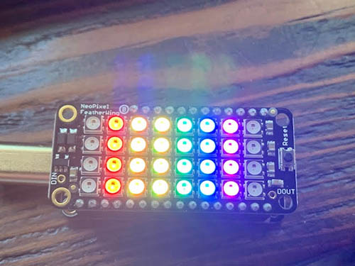
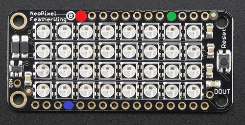
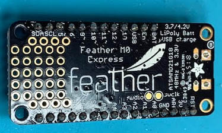
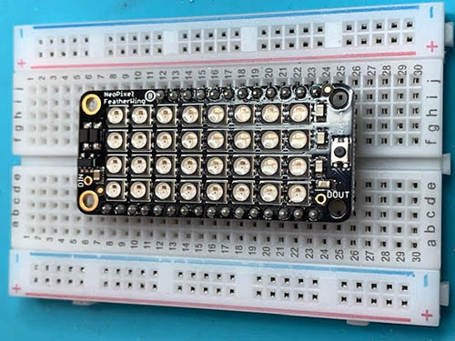
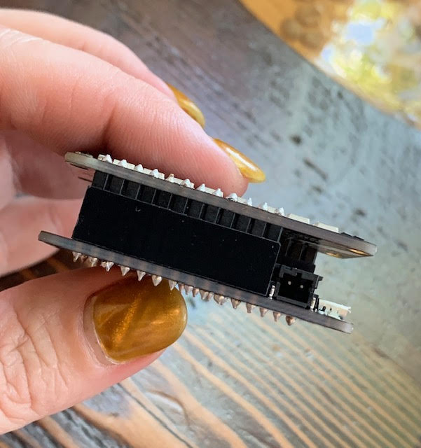

# A NeoPixel-Based Badge for Pride!

_Tammy Cravit <tammymakesthings@gmail.com>_
_Version 1.0, 06/08/2019_



June is LGBTQ Pride Month. Celebrate your pride with this fun, animated piece
of electronic jewelry!

## I Don't Want to Read All This Stuff, I Just Want to Use the Thing!

If you just want to build one of these and run it, here's the quickstart:

1. Get all the parts in the [parts list](#Parts-List).
2. Stack the [NeoPixel Featherwing] and the [Feather M0 Express].
3. Download the code. Copy the code file `fw_neopixel_matrix.py` to the 
Feather, and rename it `code.py`.
4. Power up your Feather and go to the races.

If you want to know the process I followed to design this project and how the
code works, read on.

## Design

This was a pretty simple project to design - the hardware is dead simple, and
the hardest parts were the construction and coding. Still, I'll talk through
the design process and why I made the decisions I did.

### Project Goals

These were my conceptions of what I wanted to create:

* I wanted something to display various Pride flags in a bright, visually
compelling way.
* I wanted it to be simple enough to construct that I could make several
of them for friends.
* I wanted something compact enough that I could make it into a piece of
jewelry.
* It needed to be battery powered, so I can wear it to Pride.

These became my project goals.

### Design Decisions

In the course of designing the project, I had to make a couple of key
design decisions:

* **Development Platform** Honestly, the decision of what platform I wanted
to use was probably the easiest one of the project. I'm pretty much doing
all of my projects today with [Circuit Python]-capable hardware, so that's
what I picked here.
* **Microcontroller** The Adafruit [Feather M0 Express] is frankly overkill for this
project. I could get by with a much less expensive microcontroller here. The
feather has the advantage, however, of stacking directly onto Adafruit's
FeatherWing accessories, which makes the assembly a whole lot easier. Plus,
I already had a couple of them in my parts bin.
* **Display** I thought about using an LCD or OLED for this project, but my
city's Pride festival will be outdoors in a bright sunny plaza, and I didn't
think those would be visible enough. I settled on the [NeoPixel FeatherWing],
a 4x8 grid of 5050 RGB LEDs with a one-wire driver interface. Bright, easy to
work with, and -- again -- already assembled, so the work was easy.

### If You're Not Using a Feather

If you want to use something other than one of the Feather M0/M4 Express
(like a [Trinket M0 Express] for this build, you can still use the Adafruit
[NeoPixel Featherwing]. You just have to manually make the necessary
connections, rather than using the stackable headers. On the Featherwing
board, you'll need to connect:



| Pin      | Color | Connected To                                      |
| ---      | ----- | ------------                                      |
| **VBAT** | Red   | +3.3V DC                                          |
| **#6**   | Green | An available digital input on the microcontroller |
| **GND**  | Blue  | Ground                                            |

You'll also need to adjust the setting of `neopixel_pin` in the code
to the correct pin number.

## Parts List

The following components are needed to build this project:

-   1 - Adafruit [Feather M0 Express] (You can use a [Feather M4 Express] as 
well. If you use a non-Feather [Circuit Python] board, you're on your own 
for working out the connections.)
-   1 - Adafruit [NeoPixel FeatherWing]
-   1 - Battery. This [Adafruit 400mAH LiPo] is a good choice, because it 
    will fit between the stacked Feather and FeatherWing.

The following additional parts are optional but recommended:

-   1 - SPDT power switch (such as
    [this one](https://www.adafruit.com/product/805) from Adafruit)
-   1 - JST extension cable (such as
    [this one](https://www.adafruit.com/product/1131)). We'll cut it
    apart to add a power switch to the circuit.
-   4 - skinny zip ties (such as
    [these](https://www.amazon.com/Tarvol-Nylon-Locking-Cable-White/dp/B01MRD0JRR))
-   [Pin backs](https://www.amazon.com/Shappy-Pieces-Brooch-Safety-Plastic/dp/B075R81ZSY/),
    chain, or other fasteners to wear your badge/pendant/etc.

## Construction

The construction part of this project is pretty straightforward. In fact, the
hardest part is probably figuring out how you want to attach the badge to your
clothing. Let's get started!

### Hardware

Using the Featherwing form factor, with its stackable pin headers, makes the
construction part of this project suuuuuuper easy. Here are the steps:

**Solder the female stackable headers to the Feather.** These go on the top
side of the board (the side with the USB port). I like to set the headers
into their holes, and then carefully turn the board upside down. Solder the
end pins on each header to hold everything together, and then go back and
solder the rest of the pins.



**Solder the male stackable headers to the Featherwing.** The short side of
the header comes up through the board from the bottom, and then is 
soldered on the LED side of the board. The long pins protrude down to mate
with the Feather underneath it. I like to set the long end of the pin headers 
into a solderless breadboard, then lay the Featherwing on top of it. This 
helps keep the pins aligned and parallel while you're soldering.



**Stack the Featherwing and Feather.** Gently squeeze to seat the pins into 
the connectors on the microcontroller board.



**Add a LiPo battery.** If you chose the [Adafruit 400mAH LiPo], it'll fit
nicely between the two boards, but you can use a different battery if you
want to play with the packaging. You could also design and 3-D print a
case, but I don't have convenient access to a 3-D printer, so I opted not
to do this. You can also cut the positive lead of the battery's JST
connector and splice in a power switch if you'd like. The small
prototyping area on the right side of the Feather would be a good place
to put the switch, if you decided to add it.

**Secure the boards together.** You probably could get away with just using
the friction from the pin headers to hold things, if you're gentle. But
with a LiPo battery sitting between the boards, I'm not sure I'd trust
that. Cross-crossing a skinny zip tie across each pair of holes on the
short ends of the boards will hold them together, and will also prevent the
LiPo battery from falling out.

**Attach the wearable hardware.** Some options for this include 
hot-gluing a pin back to the back side of the Feather, attaching
[jump rings] to the corner holes and putting it on a chain around
your neck, or sewing the bottom holes (on the Feather) to a costume).
Your imagination is the limit here.

### Software

The software that drives this project is pretty straightforward. The
hardest part for me was figuring out the animation as the flags appear.
I'll talk through that in a second.

#### Representing the Flag Patterns in Code

The flag patterns are represented in code by two data elements:

* **A map of colors**. This is a Python dictionary whose keys are each a
single character, and whose values are a tuple containing the RGB value
of the color. For example:

```python
color_map = {
    'R': (255, 0, 0),
    'G': (0, 255, 0),
    'B': (0, 0, 255)
}
```
* **A dictionary of designs**. The code assumes that each design is made up of
a series of colored vertical stripes, and that all four LEDs in a given
column will be the same color. The design should be an 8-character long
string, with each character corresponding to the color map key of the
color for that column.  The key for each element of the dictionary is a tag that's used by the
debugging output to identify which flag is being displayed, but can be
whatever you want. The value for each element is itself a dictionary with
two keys, `pattern` and `colors`, The `pattern` is the string given above,
and the `colors` is a reference to the color map. (I designed it this way
so different designs can have different color maps if need be.) For example, 
the traditional Pride flag is designed like so:

```py5hon
patterns = {
    pride_flag': {'pattern': '-ABCDEF-', 'colors': flag_colors},
}
```

You can add as many designs as you want, up to the limits of available
memory. I only added a few here. I got the RGB values by Googling, but
I noticed I had to adjust some of the colors to add contrast when rendered
on the very bright NeoPixels.

#### How the Design is Animated

Figuring out the animation took me a minute, but turned out to be actually
pretty simple once I got it. Here's the logic:

1. We iterate through our animation loop once for each column in the pattern
(ie, from 0 to 7). Our loop counter variable is called `i` (creative, I know).

2. On each iteration, we need to know where in the pattern we're starting and 
ending. The starting position is defined as `len(the_pattern) - i - 1` (because
indexes are 0-based) and the ending position is defined as `len(the_pattern)`.

3. Once we've figured that out, we do two loops. The first, which iterates over
`range(0, starting_column)` turns off the blank pixels on the left edge of the 
partial design. The second, which iterates over 
`range(starting_column, ending_column)`, displays the visible colored pixels.

4. Once all the pixels for this frame of the animation have been rendered, the
program sleeps for `animation_speed` seconds before rendering the next frame.

5. Once the whole design is displayed, the program sleeps for 
`SHOW_PATTERN_DELAY` seconds before moving on to the next design. Once all
designs have been rendered, the cycle repeats.

Here's an example showing step-by-step how the LGBT Pride flag is displayed
I've used "." to indicate an LED that's off because of the animation, as
distinct from an LED that's off because of a black column in the pattern. 

| **i** | **starting_position** | **ending_position** | **rendered pattern** |
| ----- | --------------------- | ------------------- | -------------------- |
| `0`   | `7`                   | `7`                 | `.......-`           |
| `1`   | `6`                   | `7`                 | `......-A`           |
| `2`   | `5`                   | `7`                 | `.....-AB`           |
| `3`   | `4`                   | `7`                 | `....-ABC`           |
| `4`   | `3`                   | `7`                 | `...-ABCD`           |
| `5`   | `2`                   | `7`                 | `..-ABCDE`           |
| `6`   | `1`                   | `7`                 | `.-ABCDEF`           |
| `7`   | `0`                   | `7`                 | `-ABCDEF-`           |

### Structure of the Code

At the very top of the code file we import the `sys` module as well as the
`time.sleep()` function. I'll explain what we're going to do with the `sys` 
module in a minute. 

Next, we set up a bunch of constants:

* `ANIMATION_SPEED`: The delay in seconds between frames of the animation.
* `SHOW_PATTERN_DELAY`: The delay in seconds between animations.
* `PATTERN_INTENSITY`: The brightness (0-1) of the NeoPixels.
* `NUM_ROWS` and `NUM_COLS`: The dimensions of the NeoPixel array.

We also declare two global variables:

* `neopixel_pin`: The pin number of the NeoPixel's control line. This is a
variable to facilitate testing, as I'll explain in the next section.

* `pixels`: the NeoPixel controller object. Also initially set to None to
facilitate testing, as I'll explain in the next section.

After this, the NeoPixel is set up. Again, I'll explain this part in the next
section.

Finally, we define the color map and the flag patterns.

Now that all the setup is done, the meat of the program begins. It consists of
the following functions:

* `clear_pixels(rows=NUM_ROWS, cols=NUM_COLS)` - This is a helper function 
that sets all of the pixels to black (ie, turns them off). It's used to reset
the state of the NeoPixels between animations.

* `set_column(display_column, rgb_value)` - Sets the color of a column of 
NeoPixels. `display_column` is a column number (0-7), and `rgb_value` is a
tuple containing the RGB value of the color to display. NeoPixels are 
addressed numbered from the top left, so the end of the first column is pixel
7 and the start of the second column is pixel 8. On an 8x4 pixel array, the
bottom right pixel is pixel 31. ``set_column()`` does a bit of math to work
out the pixels that belong to a given column.

* `slide_in_animation(the_pattern, color_map, animation_speed=ANIMATION_SPEED)` - 
Displays the animation for a single flag image. I talked through this 
[above](#how-the-design-is-animated) so I won't repeat it here. I made
`animation_speed` a parameter in case you want to animate different flags at
different speeds or something.

* `renderAllPatterns(the_patterns)` - Renders all of the patterns in 
`the_patterns` one time apiece.

Finally, we have the code which kicks off the script and makes it keep running.
It's pretty simple, and looks like this:

```python
if __name__=="__main__":
    while True:
        renderAllPatterns(patterns)
```

And that's all there is!

#### Testing the Code on your PC

When I was working out the animation logic, I wanted to be able to test the
code on my laptop with the PyCharm debugger. (This turned out to be helpful, 
because I found an off-by-one error in my animation logic that way). But, not
all of the code runs on my laptop, because things like the `board` and 
`neopixel` libraries from [Circuit Python] aren't available. What was I to do?

A good starting point to solving that was figuring out how to tell if my code
is running on Circuit Python or not. According to the 
[documentation](https://circuitpython.readthedocs.io/en/2.x/docs/library/sys.html#sys.platform),
the correct way to do so is to look at the value of `sys.implementation`. If
this constant has the value `circuitpython`, your code knows it's running on a
Circuit Python device.

So what I decided to do was to initialize `neopixel_pin` and `pixels` to `None`.
Then, I check if `sys.implementation` is `circuitpython`, and if it is, I 
import the needed Circuit Python libraries and set my hardware variables to the
proper values. Later in the code, everything which touches the hardware can 
simply check if `pixels` is `None` to skip or supply alternate behavior when 
you're not running on Circuit Python hardware. I suppose I could have made a
`has_circuit_python` global variable instead, but in this case the only 
hardware-dependent thing was the NeoPixel, so I opted to use the `pixels` 
object's value instead.

My probe for Circuit Python hardware looks like this:

```python
if sys.implementation.name == "circuitpython":
    import time
    import board
    import neopixel

    # Control pin defaults to #6
    neopixel_pin = board.D6
    pixels = neopixel.NeoPixel(neopixel_pin, (NUM_ROWS * NUM_COLS),
                               brightness=PATTERN_INTENSITY, auto_write=False)
```

An example of a place where I care about the presence or absence of the 
hardware is in `set_column()`, where I do the following:

```python
def set_column(display_column, rgb_value):
    print('Called set_column({0}, {1})'.format(display_column, rgb_value))
    if pixels is not None:
        for i in range(0, NUM_ROWS):
            which_pixel = (i * NUM_COLS) + display_column
            pixels[which_pixel] = rgb_value
```

If this code is running on Circuit Python hardware, it will update the 
NeoPixel colors. If not, the debug print statement is executed and that's all.

This is a very useful technique that makes debugging a whole lot easier. I'm 
documenting it here for your benefit, and also so I don't forget for future
projects. :laughing:

## Opportunities for Future Expansion

I'm happy with how this came out, but there are a few things I think I might
like to add to this in the future:

* [ ] Hardware buttons to jump to the previous/next design
* [ ] Error checking (the code does none, which is un-Pythonic)
* [ ] Hardware buttons to change the animation speeds

In all, though, this came out very much as I'd conceptualized it, and I'm very
proud (pun intended) of the results. I'm looking forward to lighting up the
sidewalk at Pride this year. For 2019 being the 50th anniversary of the
[Stonewall Riots], this seems fitting somehow.

Happy Pride!

## Questions/Feedback?

If you have questions/feedback, or if you build your own Pride badge and
want to share pictures, I'd love to hear from you. I can be reached by
email at tammymakesthings@gmail.com or on
[Twitter](https://twitter.com/maker_tammy).


[Feather M0 Express]: https://www.adafruit.com/product/3403
[Trinket M0 Express]: https://www.adafruit.com/product/3500
[Circuit Python]: http://www.circuitpython.org/
[Feather M4 Express]: https://www.adafruit.com/product/3857
[NeoPixel FeatherWing]: https://www.adafruit.com/product/2945
[Adafruit 400mAH LiPo]: https://www.adafruit.com/product/3898
[jump rings]: https://www.artbeads.com/jump-rings-split-rings/
[Stonewall Riots]: https://en.wikipedia.org/wiki/Stonewall_riots
